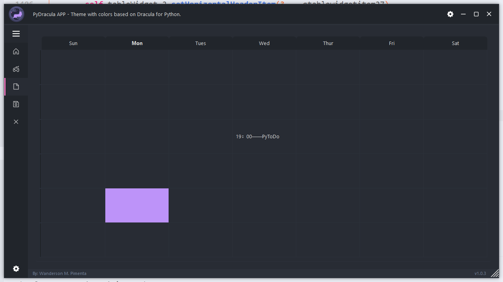
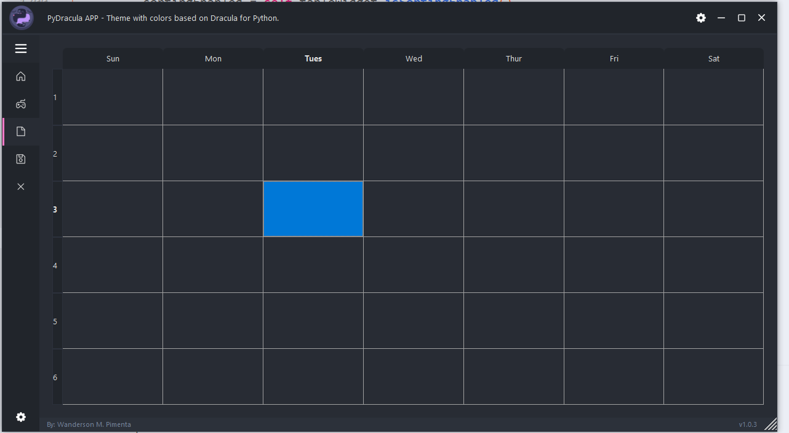

# PyToDo-Log

## 20220803-v1.0.0-zry

工作：为实现可自定义的Calendar，初步尝试使用QT Designer生成表格控件，更新main.ui文件后编译覆盖modules/ui_main.py。

问题：表格内数据类型疑似无法自定义，一是需要统一的Task类进行数据管理，二是需要实现自定义的Task任务显示框。

效果：

## 20220803-v1.0.1-zry

工作：放弃QT Designer中现成的表格控件，直接修改modules/ui_main.py中的代码，使用抽象数据类型QStandardItem及QTableView实现自定义表格。

问题：新建modules/task.py待完善，预计在此实现统一的Task数据类型，并提供各种Task编辑、显示操作接口。

效果：

## 20220804-v1.0.2-zry

工作：嵌入登录界面

问题：登录界面与软件画风割裂，主题待统一；登录界面账号密码疑似认证有问题，错误密码也能登录；关闭登录界面仍可打开软件，登录失败可能也会打开软件，需要捕捉一个登录失败的信号来反馈给软件。

## add sign_up func in database.py

*Date:2022/08/03*

*Author:YJK*

在database.py中添加sign_up_database()函数，为注册服务提供接口

## Add modules/user.py which defined User class

*Date:2022/08/03*

*Author:YJK*

在modules添加user.py，创建User类，定义User属性

## alter init in modules/user.py & add login_in func in database

*Date:2022/08/04*

*Author:YJK*

在database.py添加log_in_database()函数，为登陆服务提供接口；修改modules.user.py中User类的初始化方法

## Commit around 11:30 on 2022/08/04

*Date:2022/08/04*

*Author:YJK*

1. `database.py`：修改login_in_database函数，支持返回当前用户任务列表
2. `modules.task.py`：修改`__init__`函数，支持初始化创建`task`对象
3. 完善log和README两个md

## Add add_task_database in database.py

*Date:2022/08/04*

*Author:YJK*

1. `database.py`支持`add_tast_database`函数接口，支持为一用户添加新任务

## Commit around 23:20 on 2022/08/04

*Date:2022/08/04*

*Author:YJK*

1. `database.py`支持`delete_tast_database`函数接口，支持为一用户删除特定任务
2. `modules/task.py`：为`Task`类增加`id`属性，方便后端数据库操作确定唯一task
3. `database.py`相应修改`sign_up_database`和`add_task_database`

## Move database.py from / to /account

*Date:2022/08/05*

*Author:YJK*

1. 迁移database.py到account目录下以支持其他模块访问

## embed LoginSystem in ./account & change the UI Theme

*Date:2022/08/05*

*Author:ZRY,JSH*

1. 在./account嵌入登录系统，登录失败不打开软件
2. 改变主题为light版，删除部分原logo
3. 登录界面的风格亟待与软件统一，然而目前尝试上传图片失败，路径问题不知怎么解决
4. Task数据的显示方式亟待确定

## perf: add attributes in Task Class(task.py) add importance(int), isDaily(boolean), type(str), ddl(str), satte(str)

*Date:2022/08/05*

*Author:YJK*

1. 为`Task`类增加五个属性，并为每个属性增加类别备注，方便接口统一

## fix: fix add_task_database in database.py

*Date:2022/08/05*

*Author:YJK*

1. 根据`Task`类属性修改`add_task_database`函数

## feat: Add modify_task_database func in database.py

*Date:2022/08/05*

*Author:YJK*

1. 增加`modify_task_database`功能
2. 修改`add_task_database`，保证任务id的唯一性

## add: display test task in the calendar

*Date:2022/08/06*

*Author:ZRY*

1. 在日历模块中加入文本显示功能，目前可以实现将本地数据显示在日历中，但无法将从前端输入给日历的数据存入本地
2. 在`main.py`中调用`./calendar.py`，实现`ui_main.py`的UI文件与交互功能实现文件的分离

## feat: Add modify_task_state_database func in database.py

*Date:2022/08/07*

*Author:YJK*

1. 增加`modify_task_state_database`功能，为调整任务状态直接提供接口。

## modify: modify the calendar window

*Date:2022/08/06*

*Author:ZRY*

1. 使用`QPlainTextEdit`替代原先的抽象数据类型`QStandardItemModel`和`QTableView`，便于进一步实现前后端数据交互功能
2. 新建`./ui_calendar.py`，在`main.py`中调用`./ui_calendar.py`中的`calendar_ui_init`将独立开发的UI接入已有框架
3. 使用`css`、`html`及部分GUI控件自带函数进行字体、配色、图形界面的美化

## add: realise the Calendar Date system

*Date:2022/08/09*

*Author:ZRY*

1. 在日历界面显示日期
2. 通过`Last`与`Next`两个Button实现月份切换
3. 简单美化界面，设置日历页面`ReadOnly`

## add: realise the simple matrix 2 by 2

*Date:2022/08/10*

*Author:ZRY*

1. 实现象限UI
2. 尝试连接象限UI至Task创建页面，尝试失败：`QWidget: Must construct a QApplication before a QWidget`

## debug: fix the Finish Button and sort-display in matrix

*Date:2022/08/10*

*Author:ZRY*

1. 修复象限UI排序及显示bug
2. 重新连接象限UI中的`Finish Button`

## fix: fix connection of mymatrix.py and NewTask.py

*Date:2022/08/11*

*Author:YJK*

1. NewTask中新增NewTaskCommunicate类，用于存储类变量`mySignal`作信号，用`run`方法储存`emit`
2. 修改NewTsk类逻辑，在行为中调用NewTaskCommunicate类的`run`方法实现信号发送
3. 由于不允许传递`None`对象，因此发送Task对象和hint字符串，hint为`"Success"`时Task有效

## feat: connect new task module with database module

*Date:2022/08/11*

*Author:YJK*

1. feat:在NewTask中连接database
2. fix:database中数据库的task为空时获取不到task_max
3. fix:NewTask中获得的importance为字符串，通过截断和转型获取int类型的importance

## modify: exit task in matrix & try connecting database

*Date:2022/08/11*

*Author:ZRY*

1. 可以在本地创建任务
2. 使用账号进行task修改存在未知问题

## fix: fix title and text position in login func in database.py

*Date:2022/08/11*

*Author:YJK*

1. 修复登陆时从数据库获取task列表时属性错乱的问题：对有缺省值的`__init__`没有明确指出赋值对象

## feat: support modify existing task in NewTask

*Date:2022/08/11*

*Author:YJK*

1. NewTask支持显示已存在的Task，方式为在创建NewTask对象时设置`task`属性值

## feat: add startTime attr in Task Class & update related work in NewTask.py and database.py

*Date:2022/08/11*

*Author:YJK*

1. 为Task类增加属性`startTime`，并相应更新NewTask.py和database.py

## feat: support edit existing task in NewTask

*Date:2022/08/11*

*Author:YJK*

1. NewTask支持submit已经存在的task
2. 更新README，添加对NewTask用法的示例和说明